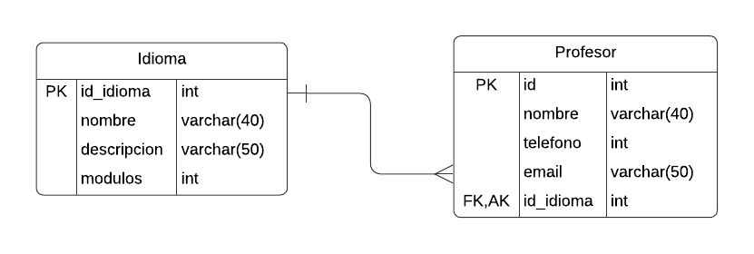

# InstitutoIdiomas
Instituto de Idiomas Pagina Web
Integrantes: Biondi, Mateo ; Bianco, Florencia.

Este trabajo aborda el desarrollo de una pagina web que consiste en una Escuela de Idiomas donde los usuarios pueden acceder a clases virtuales. 
Nuestro modelo de datos establece una relacion 1 a N entre las tablas Idioma y Profesor. 
Establecimos para nuestro sitio que un idioma puede ser enseñado por distintos profesores y que cada profesor puede enseñar un solo idioma.
La clave forànea corresponde al atributo unico id_idioma de la tabla Profesor.
La clave primaria corresponde al atributo primario autoincremental id_idioma de la tabla Idioma. 

